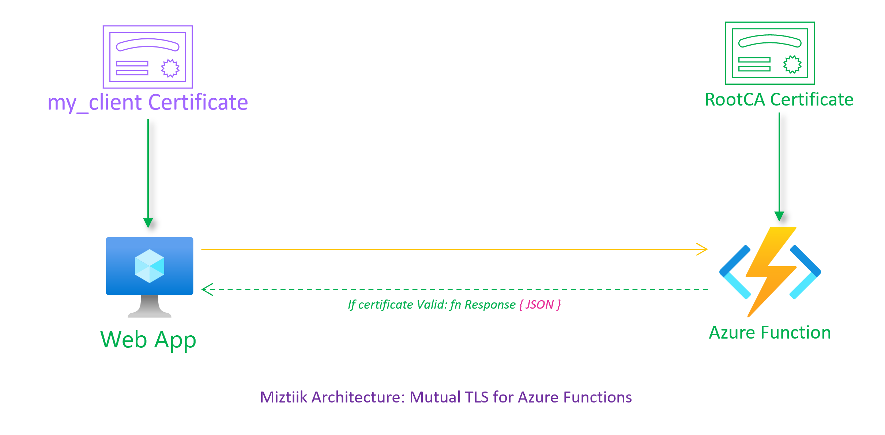
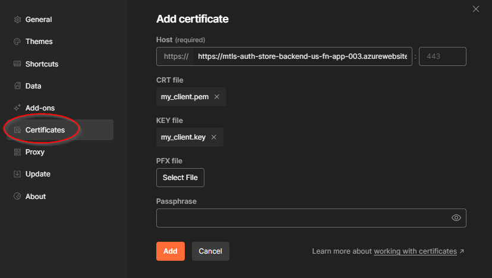
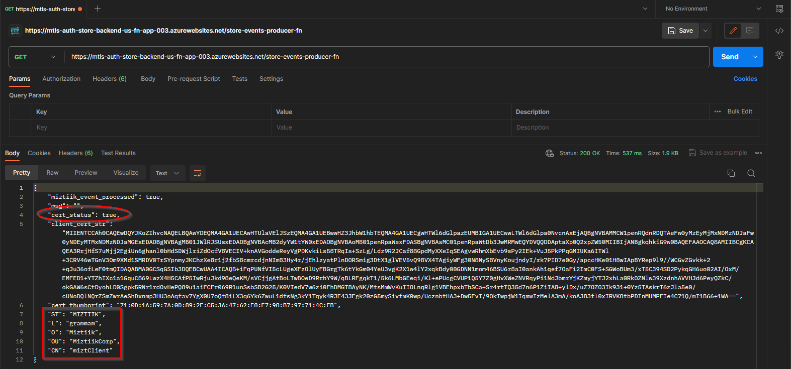
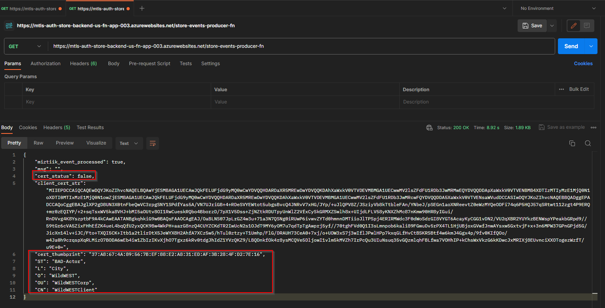

# Mutual TLS for Azure Functions



# Create the CA and server certificates

```bash
$ ./deployment_scripts/create_private_certs.sh 
Generating RSA private key, 4096 bit long modulus (2 primes)
.............++++
................................++++
e is 65537 (0x010001)

Generating RSA private key, 2048 bit long modulus (2 primes)
..........+++++
................................................+++++
e is 65537 (0x010001)

Signature ok
subject=ST = MIZTIIK, L = grammam, O = Miztiik, OU = MiztiikCorp, CN = miztClient
Getting CA Private Key
---------
my_client.csr my_client.key my_client.key.pem my_client.pem RootCA.key RootCA.pem
---------
```

Now we have the client certificate `my_client.pem` client key `my_client.key` and the CA certificate `RootCA.pem` and the CA key `RootCA.key`.

# Copy the certificates to the Azure Function App

```bash
cp certs/RootCA.pem app/function_code/store-backend-ops/store-events-producer-fn/
```


# Create the Azure Function App

```bash
make all
```


## 🎯 Test the solution

If you do not pass any certificate with the request you will get a `403 Forbidden` response.

```bash
curl -v https://mtls-auth-store-backend-us-fn-app-003.azurewebsites.net/store-events-producer-fn
```
As it is hard to setup curl to use a client certificate, we will use postman to test the solution.

Configure postman to use certificate in the settings,


Now we can send a request to the Azure Function App and we will get a `200 OK` response.


For certificate failure, I create another certifcate and use it to send a request to the Azure Function App. This time we will get a `false` response.


  
2. ## 🧹 CleanUp

   If you want to destroy all the resources created by the stack, Execute the below command to delete the stack, or _you can delete the stack from console as well_

   - Resources created during [Deploying The Solution](#-deploying-the-solution)
   - _Any other custom resources, you have created for this demo_

   ```bash
   # Delete from resource group
   az group delete --name Miztiik_Enterprises_xxx --yes
   # Follow any on-screen prompt
   ```

   This is not an exhaustive list, please carry out other necessary steps as maybe applicable to your needs.

## 📌 Who is using this

This repository aims to show how to Bicep to new developers, Solution Architects & Ops Engineers in Azure.

### 💡 Help/Suggestions or 🐛 Bugs

Thank you for your interest in contributing to our project. Whether it is a bug report, new feature, correction, or additional documentation or solutions, we greatly value feedback and contributions from our community. [Start here](/issues)

### 👋 Buy me a coffee

[](https://ko-fi.com/Q5Q41QDGK) Buy me a [coffee ☕][900].

### 📚 References

1. [Azure Docs - Mutual TLS][2]

[2]: https://learn.microsoft.com/en-us/azure/app-service/app-service-web-configure-tls-mutual-auth?tabs=azurecli


### 🏷️ Metadata


**Level**: 200

[100]: https://www.udemy.com/course/aws-cloud-security/?referralCode=B7F1B6C78B45ADAF77A9
[101]: https://www.udemy.com/course/aws-cloud-security-proactive-way/?referralCode=71DC542AD4481309A441
[102]: https://www.udemy.com/course/aws-cloud-development-kit-from-beginner-to-professional/?referralCode=E15D7FB64E417C547579
[103]: https://www.udemy.com/course/aws-cloudformation-basics?referralCode=93AD3B1530BC871093D6
[899]: https://www.udemy.com/user/n-kumar/
[900]: https://ko-fi.com/miztiik
[901]: https://ko-fi.com/Q5Q41QDGK